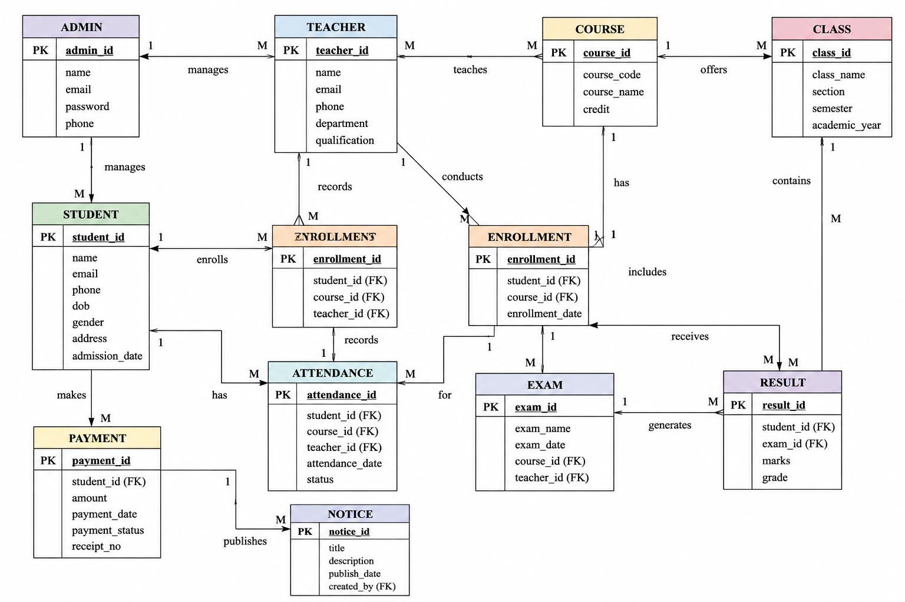

# Software Requirements Specification (SRS)

## Preface

This document provides the Software Requirements Specification (SRS) for the **Student Management System (SMS)**. It defines the system’s functionalities, performance criteria, security requirements, and overall system architecture necessary for development.

---

## Version History

* **Version 1.0** – Initial Draft.
* **Version 1.1** – Added non-functional requirements and system models.
* **Version 1.2** – Refined system evolution and glossary.

---

# 1. Introduction

## Purpose

The Student Management System (SMS) is a web-based application designed to streamline academic and administrative activities within educational institutions. The system enables efficient student record management, attendance tracking, course management, result processing, communication, and reporting.

## Document Conventions

This document follows the IEEE SRS standard, using:

* **Must** – Indicates mandatory requirements.
* **Should** – Indicates recommended features.
* **May** – Indicates optional enhancements.

## Intended Audience and Reading Suggestions

* **Administrators & Developers** – For implementation and maintenance guidance.
* **Teachers & Academic Staff** – To understand system operations and functionalities.
* **Students & Parents** – To understand user features and access.
* **Testers & QA Teams** – To validate compliance with requirements.

## Scope

The system provides:

* Student registration and profile management
* Course and class management
* Attendance tracking
* Examination and grading system
* Fee and payment management
* Notifications and communication
* Reporting and analytics
* Role-based access control

## References

* IEEE Standard 830-1998 (Software Requirements Specification)
* Institutional Academic Policies
* Internal Business Requirement Specification (BRS)

---

# 2. Overall Description

## Product Perspective

The Student Management System is a standalone web application that may integrate with external services such as email systems, SMS gateways, and online payment platforms.

## Product Functions

* **Student Management:** Register and maintain student records.
* **Course Management:** Manage courses, subjects, and schedules.
* **Attendance Management:** Record and monitor student attendance.
* **Examination & Grading:** Manage exams, marks, and report cards.
* **Fee Management:** Handle tuition fees and payment tracking.
* **Communication:** Notifications for announcements, results, and attendance alerts.
* **Reporting & Analytics:** Generate academic and administrative reports.

## User Classes and Characteristics

* **Admin:** Manages users, courses, fees, and system settings.
* **Teacher:** Manages attendance, assignments, exams, and grades.
* **Student:** Views courses, attendance, results, and notices.
* **Parent:** Monitors student progress and attendance.

## Operating Environment

* Web-based application (accessible via Chrome, Firefox, Edge).
* Cloud-hosted infrastructure.
* **Database:** MySQL / MongoDB.

## Design and Implementation Constraints

* Compliance with data protection and privacy regulations.
* Scalability for schools, colleges, and universities.
* Internet connectivity required for real-time updates.

## Assumptions and Dependencies

* Users have valid login credentials.
* The institution provides server and network infrastructure.
* Future mobile application support may be considered.

---

# 3. System Requirements Specification

## Functional Requirements

### User Authentication

* The system must allow users to register, log in, and reset passwords.
* The system must implement role-based authentication (Admin, Teacher, Student, Parent).
* The system must securely store user credentials.

---

### Student Management

* Admins must be able to add, edit, and delete student records.
* The system must maintain student profiles including personal and academic details.
* Students must be assigned unique identification numbers.

---

### Course & Class Management

* Admins must be able to create and manage courses and classes.
* Teachers must be assigned to specific courses.
* Students must be enrolled in courses and sections.

---

### Attendance Management

* Teachers must be able to mark attendance daily.
* Students and parents must be able to view attendance records.
* The system must generate attendance reports automatically.

---

### Examination & Grading

* Teachers must be able to create exams and upload marks.
* The system must calculate grades automatically.
* Students must be able to view results online.

---

### Fee Management

* Admins must be able to manage fee structures.
* The system must track paid and unpaid fees.
* The system should support online payment integration.

---

### Notifications & Communication

* The system must send alerts for attendance shortages, exam schedules, and fee due dates.
* Admins and teachers should be able to post announcements.

---

### Reporting & Analytics

* The system must generate student performance reports.
* Reports should be exportable in PDF and CSV formats.
* Admins should be able to generate institution-wide analytics.

---

## Non-Functional Requirements

### Performance Requirements

* The system must support 1000+ concurrent users.
* Attendance and result updates must reflect in real time.

---

### Security Requirements

* The system must implement role-based access control.
* Sensitive data must be encrypted.
* The system must maintain audit logs for critical activities.

---

### Usability Requirements

* The system should provide an intuitive and user-friendly interface.
* The system must support accessibility standards.

---

### Reliability and Availability

* The system must ensure 99.9% uptime.
* Regular backups must be maintained for disaster recovery.

---

### Maintainability and Support

* The system must support modular updates and maintenance.
* Logging and debugging mechanisms must be implemented.

---

### Portability

* The system should be accessible from Windows, Mac, and Linux.
* The system must support cloud deployment.

---

# 4. System Models

> * **CONTEXT DIAGRAM**
>
>   

> * **ACTIVITY DIAGRAM**
>
>   

> * **USE CASE DIAGRAMS**
>
>     

> * **SEQUENCE DIAGRAM**
>
>   

> * **ENTITY-RELATIONSHIP DIAGRAM**
>
>   

> * **STATE DIAGRAM**
>
>   

---

# 5. System Evolution

## Assumptions

* AI-based analytics may be integrated in the future.
* Future mobile application support.
* Scalability for multiple institutions and campuses.

## Expected Changes

* Integration with third-party learning management systems.
* AI-powered student performance prediction.
* Online live class integration.

---

# 6. Appendices

## Hardware Requirements

* Cloud-based infrastructure with scalable servers.
* Minimum 8GB RAM and multicore processors for server deployment.

## Database Requirements

* Must maintain logical relationships between students, teachers, courses, attendance, and results.
* Database must support backup and recovery mechanisms.

## Glossary

| Term  | Description                      |
| ----- | -------------------------------- |
| SMS   | Student Management System        |
| Admin | System administrator             |
| GPA   | Grade Point Average              |
| RBAC  | Role-Based Access Control        |
| UI/UX | User Interface / User Experience |
sting: AWS, Azure, or Google Cloud Platform
